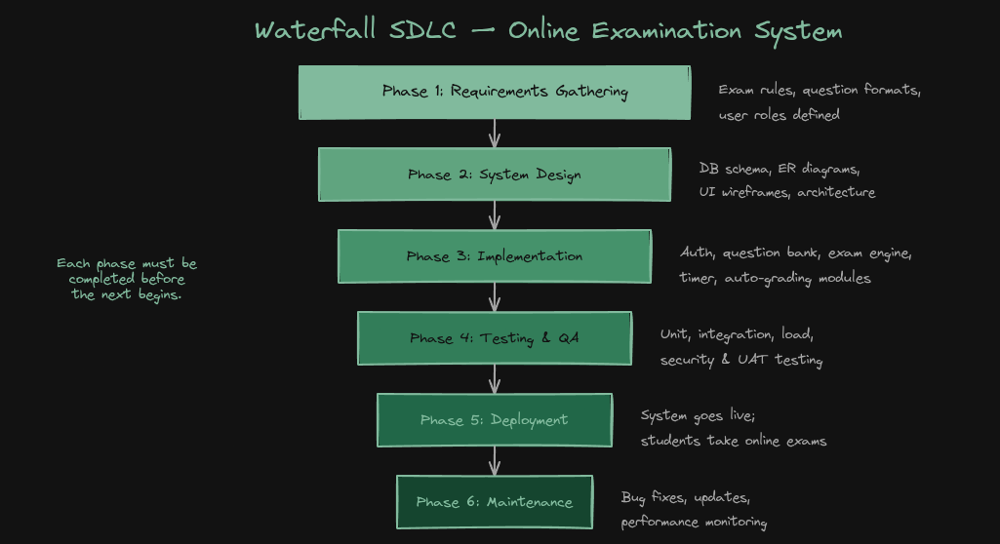

# Online Examination System  
## SDLC Model: Waterfall Model  

| Field              | Details                                  |
|--------------------|------------------------------------------|
| Course             | Software Engineering                     |
| Assignment Type    | Individual                               |
| Time               | 48 Hours                                 |
| Topic              | SDLC Model Selection & Justification     |

---

## 1. Introduction

An Online Examination System is a structured digital platform that allows educational institutions to conduct examinations over the internet. It manages the full examination lifecycle — from question paper creation and candidate registration to real-time exam delivery, automated evaluation, and result publication.

The system typically includes modules for question bank management, randomized paper generation, anti-cheating mechanisms (tab-switch detection, full-screen enforcement), timer management, result computation, and report generation. The system is used by universities, entrance boards, and competitive exam authorities where accuracy, security, and reliability are paramount.

---

## 2. Selected SDLC Model: Waterfall

The Waterfall SDLC model has been selected for the Online Examination System. The Waterfall model is a linear-sequential software development process in which development flows downward through clearly defined phases:  

**Requirements → System Design → Implementation → Testing → Deployment → Maintenance**
| Phase No. | Phase Name        |
|----------|------------------|
| 1        | Requirements      |
| 2        | System Design     |
| 3        | Implementation    |
| 4        | Testing           |
| 5        | Deployment        |
| 6        | Maintenance       |

Each phase must be completed and verified before moving to the next.

### Model Details

- **Model:** Waterfall (Linear Sequential)  
- **Development Style:** Phase-by-phase, top to bottom  
- **Documentation:** Extensive — each phase documented  
- **User Involvement:** Primarily at requirements phase  
- **Best For:** Well-defined, stable requirement projects  

---

## 3. Justification (Why Waterfall?)

### 3.1 Stable and Well-Defined Requirements

An Online Examination System has clearly understood requirements that do not change significantly once defined. The exam board knows in advance: how many candidates will appear, what subjects are covered, what exam formats are needed, and what security protocols must be followed. With stable requirements, Waterfall's rigid phase structure is an advantage rather than a limitation.

### 3.2 Strict Quality and Documentation Standards

Educational and government examination bodies require rigorous documentation at every stage for auditing and accountability. Waterfall mandates complete documentation of requirements, design specifications, test plans, and user manuals before moving to the next phase. This ensures a verifiable paper trail — essential for institutions governed by regulatory bodies.

### 3.3 Low Risk of Changing Requirements Mid-Project

Unlike a startup product, an examination system is built based on established educational standards and exam rules. The probability of a mid-project scope change is very low, making Waterfall highly suitable. The model's inability to easily accommodate changes mid-cycle is not a drawback here — it is aligned with the project's stability.

### 3.4 Clear Project Milestones and Deliverables

Waterfall provides clear milestones: requirements approval, design freeze, code complete, test complete, and deployment. For an institution that must plan around academic calendars and regulatory deadlines, having predictable, time-bound deliverables is critical. Waterfall's phase-gate approach ensures each deliverable is reviewed and signed off before proceeding.

### 3.5 Testing Phase Can Be Comprehensive

Since all features are built before testing begins, the testing phase in Waterfall can be exhaustive and systematic. For an examination system where a single bug could invalidate thousands of results, comprehensive pre-deployment testing is essential. A dedicated testing phase allows the team to conduct unit testing, integration testing, load testing (for concurrent users), and security penetration testing methodically.

---

## 4. Comparison with Other Models

### 4.1 Agile Model — Not Ideal

While Agile is excellent for dynamic products, it is less suitable for an Online Examination System because:

1. Examination systems require complete, integrated software before going live — partial delivery via sprints could lead to incomplete features being exposed to students.  
2. Agile's continuous change accommodation is unnecessary since exam requirements rarely change mid-project.  
3. Agile requires constant stakeholder involvement, which is difficult for exam authorities with bureaucratic decision-making processes.  
4. Security and compliance reviews are harder to conduct in short sprints.  

### 4.2 Incremental Model — Not Suitable

The Incremental model delivers functionality in portions (increments). For an examination system:

1. The system must be fully integrated before any exam is conducted — you cannot run an exam with only half the features available.  
2. Security mechanisms, result calculation, and paper delivery must all be present simultaneously, making incremental deployment impractical.  
3. Validation across all modules must happen together to ensure data consistency — incremental releases complicate this.  

---

## 5. Waterfall SDLC Diagram

The following diagram illustrates the Waterfall lifecycle for the Online Examination System:

### Diagram References

For reference , the original diagram created using excalidraw is available below:

- **Excalidraw File:** `exam-system.excalidraw`
- **Excalidraw Link:** [Open Diagram](https://excalidraw.com/#json=Q0QE4dyWBw4wLMh-EaiuM,N8cNRM19LVe6ctoKwoVKUg)

> The Excalidraw file can be opened using https://excalidraw.com

### Phase Breakdown

**Phase 1**  
Requirements Gathering — Exam rules, user types, security needs, question formats  

**Phase 2**  
System Design — ER diagrams, UI wireframes, database schema, system architecture  

**Phase 3**  
Implementation — Coding all modules: auth, question bank, exam engine, timer, grading  

**Phase 4**  
Testing — Unit, integration, load, security, and UAT testing  

**Phase 5**  
Deployment — System goes live for actual examinations  

**Phase 6**  
Maintenance — Bug fixes, performance monitoring, annual updates  

---

### Flow

Requirements -> Design -> Implementation -> Testing -> Deployment -> Maintenance  
(each phase completes before the next begins)

---

## 6. Conclusion

The Waterfall SDLC model is the most appropriate choice for developing an Online Examination System. The system has well-defined, stable requirements set by educational authorities; demands rigorous documentation for audit compliance; requires comprehensive testing before any live examination; and must be fully functional before deployment.

These characteristics align perfectly with Waterfall's sequential, phase-driven, documentation-heavy approach. Agile's flexibility is unnecessary given the stability of requirements, and incremental delivery would create operational risks in an examination context. Waterfall's structured and disciplined methodology ensures the system is built correctly the first time — which is exactly what an examination platform demands.

---

