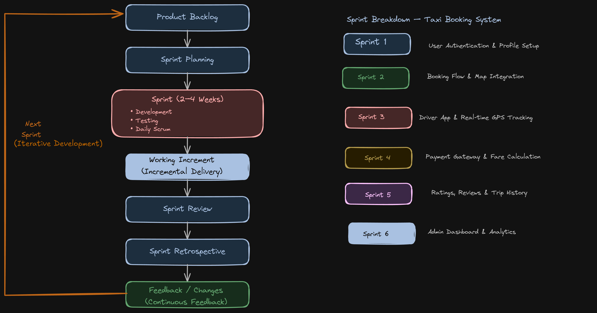

# Taxi Booking System  
## SDLC Model: Agile Methodology  

---

## Project Details

| Field              | Details                                  |
|--------------------|------------------------------------------|
| Course             | Software Engineering                     |
| Assignment Type    | Individual                               |
| Topic              | SDLC Model Selection & Justification     |
| Submitted by             | Jinnatul Iqbal     |
| Roll Number        | 230710007020    |

---

## 1. Introduction

A Taxi Booking System is a technology-driven platform that enables users to book cabs through a mobile or web application in real-time. It connects passengers with nearby drivers, handles fare calculations, live GPS tracking, payment processing, and ride history management.

Modern examples like Ola and Uber demonstrate how such systems must evolve continuously based on user feedback, market demands, and technological innovation. The system must integrate with maps APIs, payment gateways, and push notification services, making it a highly dynamic and evolving software product.

---

## 2. Selected SDLC Model: Agile

The Agile SDLC model has been selected for the Taxi Booking System. Agile is an iterative and incremental approach to software development that emphasizes collaboration, customer feedback, and small, rapid releases. Development occurs in short cycles called 'sprints' (typically 2–4 weeks each), allowing the team to adapt to changing requirements at any stage.

### Model Characteristics

| Aspect              | Details                                  |
|--------------------|------------------------------------------|
| Model              | Agile (Scrum Framework)                  |
| Sprint Duration    | 2–4 weeks per sprint                     |
| Key Benefit        | Continuous delivery & adaptability       |
| User Involvement   | High — feedback after every sprint       |
| Best For           | Dynamic, market-driven applications      |

---

## 3. Justification (Why Agile?)

### 3.1 Evolving & Unstable Requirements

A taxi booking application operates in a highly competitive market where requirements frequently change. New features such as ride-sharing pools, scheduled rides, EV filtering, in-app chat, and SOS buttons emerge as market trends shift. Agile accommodates these changes gracefully since each sprint can incorporate new user stories without disrupting the entire project timeline.

### 3.2 High User Involvement & Continuous Feedback

Taxi apps require constant validation from real end-users — both riders and drivers. Agile enables the product team to release working increments (e.g., login → booking flow → payment) and collect feedback after each sprint. This ensures the product aligns with actual user needs rather than assumptions made at the beginning.

### 3.3 Risk Management Through Incremental Delivery

Building and deploying the system in sprints means bugs and integration issues are caught early. For example, the GPS tracking module can be tested independently before integrating with payment. This reduces the risk of a catastrophic failure at the end of the project, which is common in sequential models.

### 3.4 High Complexity & Third-Party Integrations

The system integrates Google Maps API, Stripe/Razorpay for payments, Firebase for real-time tracking, and SMS gateways. Agile sprints allow the team to integrate and test one API at a time, incrementally building complexity rather than attempting all integrations simultaneously at the end.

### 3.5 Competitive Market & Fast Time-to-Market

In a market dominated by Ola and Uber, time-to-market is critical. Agile allows a Minimum Viable Product (MVP) — basic booking and ride-tracking — to be released early, while premium features like loyalty points, carpooling, and analytics dashboards are added in later sprints.

---

## 4. Comparison with Other Models

### 4.1 Waterfall Model — Not Suitable

| Reason | Explanation |
|--------|------------|
| Changing Requirements | Market demands evolve constantly |
| Late Feedback | No working software until late stages |
| High Cost of Changes | Requires restarting earlier phases |
| Late Testing | Integrations tested too late |

### 4.2 Spiral Model — Less Suitable

| Reason | Explanation |
|--------|------------|
| High Overhead | Requires detailed risk analysis every cycle |
| Expensive | Not suitable for startup-style apps |
| Slower Delivery | Lacks Agile’s rapid sprint cycles |

---

## 5. Agile SDLC Diagram

The following diagram illustrates the Agile lifecycle for the Taxi Booking System. Each sprint produces a working increment of the software.

### Diagram References

I have added the original excalidraw file and it link for reference :

- **Excalidraw File:** `taxi-booking-system.excalidraw`
- **Excalidraw Link:** [Open Diagram](https://excalidraw.com/#json=f3bWbzWOhmlCcq1IBhae9,9SEiVCTXXAy_nJfQ27dJHg)

> The Excalidraw file can be opened and edited using https://excalidraw.com

---

### Sprint Breakdown

| Sprint   | Feature                          |
|----------|----------------------------------|
| Sprint 1 | User Authentication & Profile    |
| Sprint 2 | Booking Flow & Map Integration   |
| Sprint 3 | Driver App & GPS Tracking        |
| Sprint 4 | Payment Gateway Integration      |
| Sprint 5 | Ratings & Ride History           |
| Sprint 6 | Admin Dashboard                  |

---

### Agile Process Flow

Product Backlog -> Sprint Planning -> Sprint (2–4 weeks) -> Daily Scrum -> Sprint Review -> Sprint Retrospective -> Repeat

---

## 6. Conclusion

The Agile SDLC model is the most appropriate choice for developing a Taxi Booking System. Given the highly dynamic nature of the ride-hailing market, the need for continuous user feedback, complex third-party integrations, and the competitive pressure to launch quickly, Agile's iterative sprint-based approach provides the ideal framework.

Agile ensures that working software is delivered early and improved continuously, reducing risks and aligning the product with real market needs. Models like Waterfall are too rigid for such a product, while Spiral is too expensive and formal. Therefore, Agile stands as the clear and justified choice for this project.

